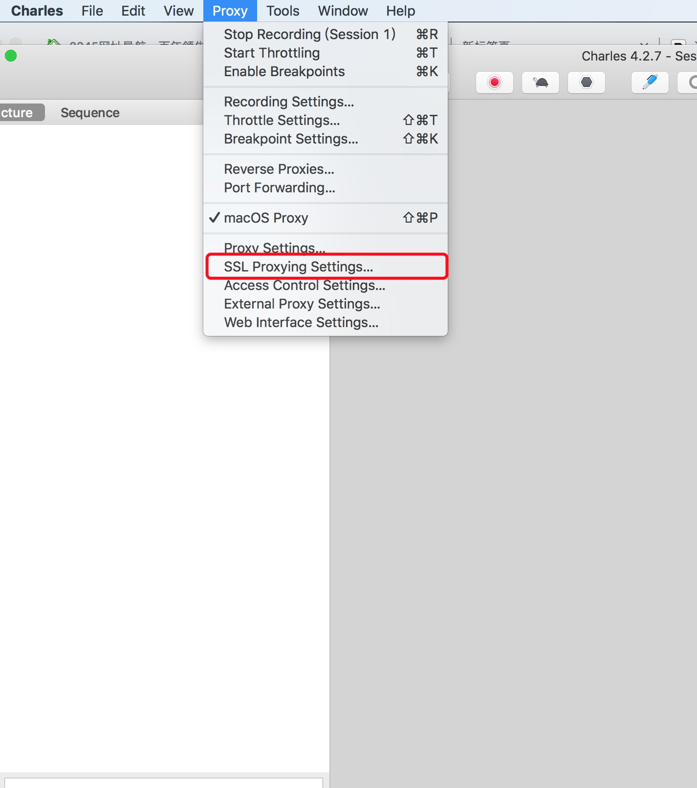
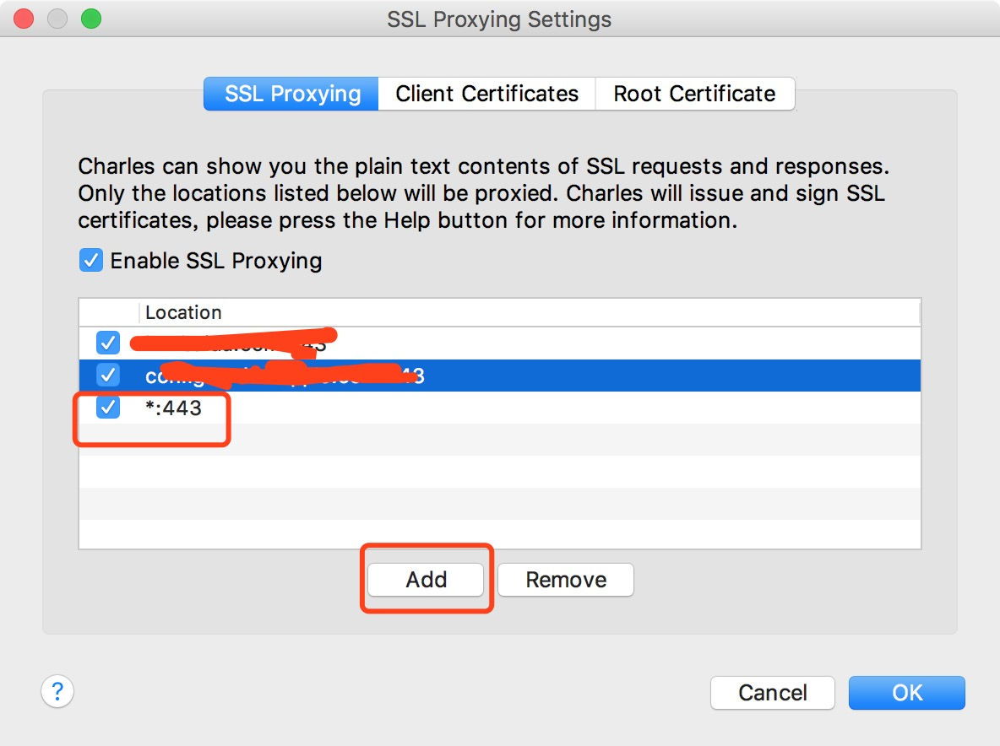
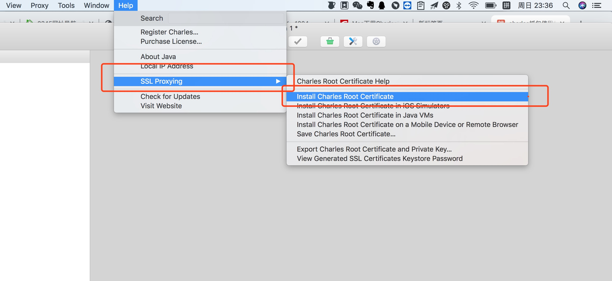
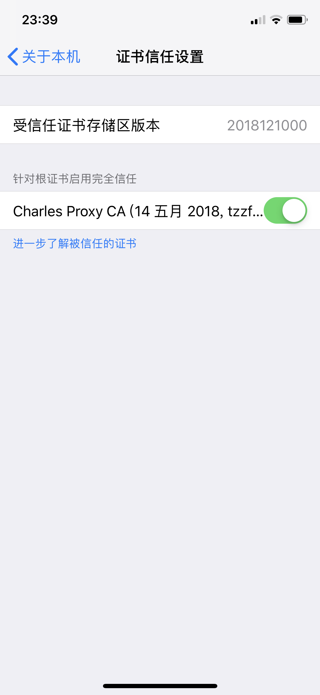
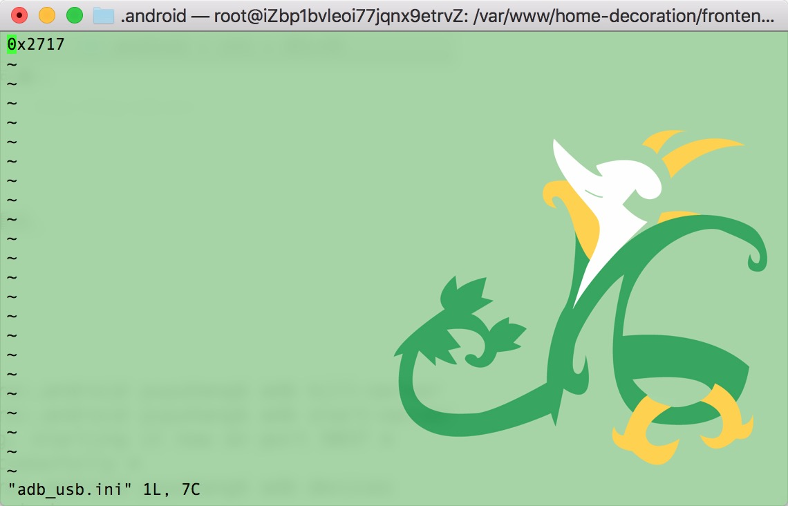
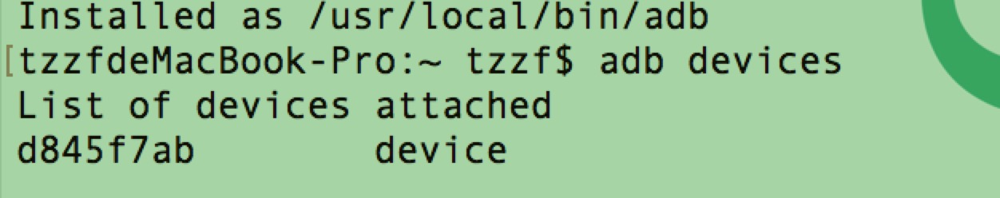
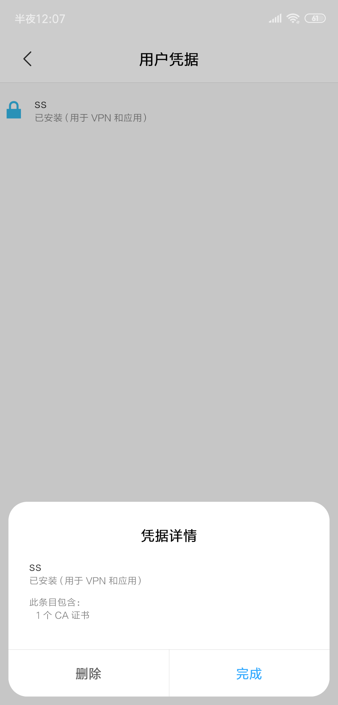

---
tags:
  - debug
date: 2019-04-07
title: 移动端debug
vssue-title: 移动端debug
---

移动端debug

<!-- more -->

最近在开发小程序中的过程中，需要对接口进行抓包了来denbug或者了解别的的小程序是怎么做的。
<br />
我的用的工具的是mac和charles进行抓包的
<br />
但是由于小程序的的接口都是https的，https是需要证书，所以抓包会比较复杂一些
<br />
第一步允许抓包443端口的请求
<br />


<br />
这里的星号代表是匹配所有的443端口的请求
<br />
第二步客户端下载ssl证书，
<br />

<br />
第三步就是给手机信任证书，所以的请求才会被验证通过的。这里呢，由于安卓和ios的证书安装方式不同，我就分开介绍了。
<br />
ios
<br />
设置 -> 通用 -> 关于本机 -> 证书信任设置
<br />

<br />
安卓
<br />
安卓呢，就有点复杂了。安卓需要做些预热处理
<br />
> Android 调试桥 (adb) 是一个通用命令行工具，其允许您与模拟器实例或连接的 Android 设备进行通信。它可为各种设备操作提供便利，如安装和调试应用，并提供对 Unix shell（可用来在模拟器或连接的设备上运行各种命令）的访问

那么开始安装adb吧。
```
brew cask install android-platform-tools
```
```
adb devices 查看系统是否识别设备(List of devices attached 是没有识别到设备)
```
当遇到没有识别到设备的情况时，有如下几种情况
1. 电脑端的adb_usb文件内，并没有链接手机设备的id。
<br />
MAC终端下，命令行执行system_profiler SPUSBDataType，显示外接设备信息。里面找到Android的Vendor ID
<br />
然后将vendor id的值写入 /User/你对应的用户文件夹/.android/adb_usb.ini文件。若该文件不存在，则新建一个。
<br />

2. 手机端未打开usb调试模式
那我就根据我的米8来做例子去打开usb调试模式。先要开发者模式，打开usb调试。
<br />

<br />
以上adb就可以链接到手机了。
<br />
然后将第二步下载的证书，通过adb传送到手机。首先先切换到证书所在文件夹下
```
adb push charles-ssl-proxying-certificate.pem sdcard/charles.pem
```
还是以米8为例子，我是在设置—>更多设置—>系统安全—>加密与凭据—>从存储设备安装从adb发送过来的pem文件
<br />
这里有个小说明：小米手机对sdcard文件的存取，做了安全限制。如果你没有设置屏幕锁，或者没有开启屏幕锁，操作sdcard文件时会出现上面的提示（具体可参见http://www.miui.com/thread-3244178-1-1.html）。这时，你需要设置一下屏幕锁，再重新安装一下就行了。
<br />
安装成功，就可以在手机的用户凭证那找到你刚安装的证书
<br />

<br />
以上就是抓包的总结了


