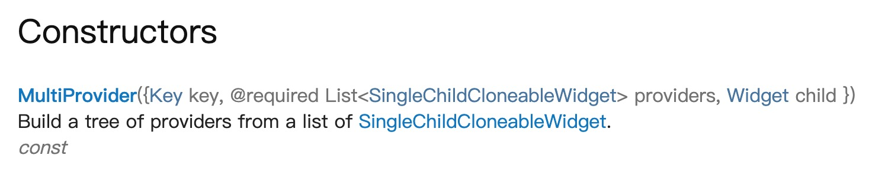
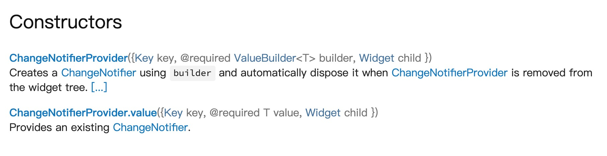
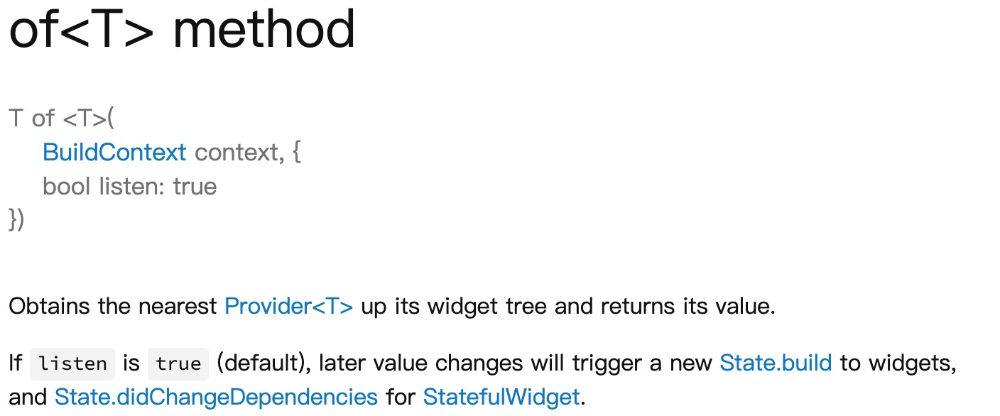

---
tags:
  - flutter
date: 2019-11-17
title: flutter全局状态管理provider
vssue-title: flutter全局状态管理provider
---

flutter全局状态管理provider

<!-- more -->
在开发项目中，不论是网页还是app，在获取到后端数据后，有些数据（用户信息）都是需要放在全局之中的，因为在业务逻辑之中肯定需要是需要多页面共享一个状态（用户数据），那么为了方便开发便于维护，方便获取，那么我们就需要利用全局状态管理方式来管理这些需要被共享的状态。
<br />
<h2>Provider</h2>
而provider正是谷歌为了解决这种方法推出的一种解决方法。那么下面我开始介绍下provider的使用。

<h2>添加依赖</h2>
在pubspec.yaml中添加provider的依赖,版本你需要去[flutter包网站](https://pub.dev/packages)这个网站上去查看最新版本是什么。
```
provider: ^3.1.0+1
```

<h2>创建model</h2>
这里和vuex和redux类似，放到一个文件夹下统一管理多状态。
<br>
在lib文件夹下创建provide文件夹，然后新建一个model文件（counter.dart）。

```

import 'package:flutter/foundation.dart';


class CounterProvider with ChangeNotifier{
   int _count = 0;

  // 获取state里的值
  int get count => _count;

  // 创建方法来修改state里的值
  void increment() {
    _count++;
    notifyListeners(); 
  }
}

```

<h2>在顶层引入state</h2>

```

import 'package:provider/provider.dart';
import '../provide/counter.dart';
import '../provide/book.dart';

......

@override
Widget build(BuildContext context) {
    return MultiProvider(
        providers: [
        ChangeNotifierProvider(builder: (_) => CounterProvider()),
        ChangeNotifierProvider(builder: (_) => BookProvider()),
        ],
        child: MaterialApp(
        home: MyApp(),
        debugShowCheckedModeBanner: false,
        ),
    );
}

```

这里我展示的多状态引入，一般项目也不会只有一个全局状态。
<br />
MultiProvider 是provider添加多状态提供的api

<br>
ChangeNotifierProvider 相当于监听数据更新，然后通知子页面

<br>


<h2>在需要state的子页面获取状态</h2>

```
import 'package:provider/provider.dart';
import '../../provide/counter.dart';


...

final counter = Provider.of<CounterProvider>(context);

...

Container(
    child: Text('${counter.count}次数'),
),
Container(
    child: RaisedButton(
        onPressed: () {
            print('点击了');
            Provider.of<CounterProvider>(context, listen: false).increment();
        },
        child: Text('点击增长'),
    )
),
```

<br>
Provider.of 是子页面获取顶层数据的方法。

<br>
context 是上下文。 listen 就是state更新是否更新，用法就是如果是变量是写true（默认为true）,如果是方法，就写false。
<br />


以上就是provider的一种简易使用，provider还提供其他更高级的api使用。由于我还未使用过，就不赘述了。
<br />
