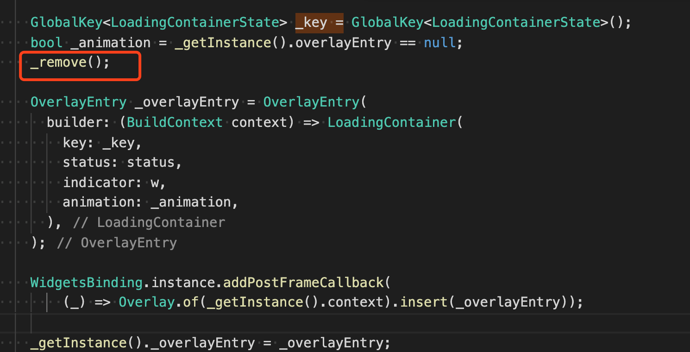

---
tags:
  - flutter
date: 2020-03-19
title: flutter dio封装
vssue-title: flutter dio封装
---

flutter dio封装

<!-- more -->

## 痛点

使用app的过程中，接口的请求是必不可少的。为了在开发高效，我当然要尝试封装dio插件。在最近的多个app开发中，尝试多种封装的方法，于是乎就得出啦一下的一套方法。

## 封装

在封装之前，需要确定我们需要那些需求。

1. 部分接口的请求过程中需要一个loading来表示这个接口正在请求中。
2. 接口要可以抛出异常的toast
3. 不同的接口有不同的请求方法，不同的contentType
4. 对响应请求的统一处理

<br/>
那么先上满足以上的简陋版本
<br/>

安装插件
```
dio: "^3.0.9"
flutter_easyloading: ^1.1.2
```

<br />

```
import 'dart:collection';
import 'package:dio/dio.dart';
import 'package:flutter_easyloading/flutter_easyloading.dart';
import 'package:testmuban/constant/constant.dart';
class _Service {
  _Service() {
    _initDio();
  }
  Dio _dio = new Dio();
  static String token;
  void setToken(String tk) {
    token = tk;
  }

  void _initDio () {
    // 接口日志
    _dio.interceptors.add(LogInterceptor(responseBody: true, requestBody: true));
    _dio.interceptors.add(InterceptorsWrapper(
        onRequest: (RequestOptions options){
          // 超时时间
          options.connectTimeout = 3000;
          // 在请求被发送之前做一些事情
          return options;
        },
        onResponse: (Response response) {
          // 在返回响应数据之前做一些预处理
          if (response.data['code'] != '200') {
            EasyLoading.showError('Failed with Error',duration: Duration(seconds: 3));
          }
          return response;
        },
        onError: (DioError error) {
          // 当请求失败时做一些预处理
          EasyLoading.showError('Failed with Error',duration: Duration(seconds: 3));
          return error;
        },
    ));
  }
  // 真正发请求的地方
  Future fetch(url, {
      dynamic params,
      Map<String, dynamic> header,
      Options option,
      bool isShowLoading = false
    }) async{
    Map<String, dynamic> headers = new HashMap(
    );
    headers['Authorization'] =  token;
    if (header != null) {
      headers.addAll(header);
    }
    if (option != null) {
      option.headers = headers;
    } else {
      option = new Options(method: "get");
      option.headers = headers;
    }
    // 是否需要 loading
    if (isShowLoading) {
      EasyLoading.show(status: 'loading...'); 
    }
    try {
      // 发送请求获取结果
      Response _response = await _dio.request('${Constant.baseUrl}$url', data: params, options: option);
      // 返回真正结果
      return _response;
    } catch (error) {
      // 异常提示
      EasyLoading.dismiss();
    } finally {
      // 不管结果怎么样 都需要结束Loading
      EasyLoading.dismiss();
    }
  }
}
final _Service service = new _Service();

```

接下来是使用这个封装的

```
import 'package:dio/dio.dart';
import 'package:testmuban/constant/constant.dart';
import 'package:testmuban/service/service.dart';
class Api {
  // 获取用户信息
  static Function get getBasketball => () => service.fetch('onebox/basketball/nba?key=${Constant.juheKey}', isShowLoading: true);

  // static Function get login => (param) => service.fetch('login', params: param, isShowLoading: true, option: new Options(method: "post"));

}

```

这里各位还需要看下[flutter_easyloading的使用教程](http://s0pub0dev.icopy.site/packages/flutter_easyloading)
<br />
这里我在使用过程中还发现了一个小问题

```
Unhandled Exception: 'package:flutter/src/widgets/overlay.dart': Failed assertion: line 132 pos 12: '_overlay != null': is not true.

```

<br />
我看源码发现，remove函数会设置_overlay = null, 这里就是因为我请求报错的就会去showError，然后这个又会去走_show方法。_show方法中在渲染之前一定都会去remove，但是因为渲染ui的异步操作，导致中间出现调用了两次remove的情况。
<br />

这里的WidgetsBinding.instance.addPostFrameCallback就是异步操作，所以导致在出现了连续两次remove。
<br />
于是，我就通过在service中添加标识位的方法来避免连续两次remove。
<br/>
以下是我加的代码

```
static bool isToast = false;
void setToast(bool val) {
  isToast = val;
}

// 在报错之前设置标识为true
setToast(true);
EasyLoading.showError('Failed with Error',duration: Duration(seconds: 3));

// 不管结果怎么样 都需要结束Loading
if (isShowLoading && !isToast) {
  EasyLoading.dismiss();
} else if (isToast) {
  setToast(false);
}
```

但是这个方法只针对这个工具函数，最终还是需要提下issue或者pr，让owner去将方法改成同步或者添加个标识位判断下。
<br />
[封装地址](https://github.com/tzzf/flutterdio)
<br/>

## 总结

在封装前，先考虑下自己的需求是什么。封装后如果出现来报错也不要慌，一点点看源码，看他们步骤调用了那些函数。以上就是我最近app项目的dio封装总结。


