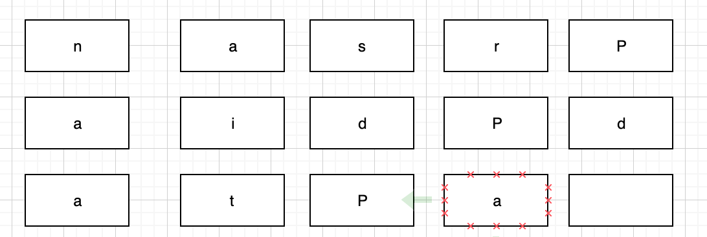

---
tags:
  - other
date: 2020-11-01
title: nas数据存储和备份
vssue-title: nas数据存储和备份
---

nas数据存储和备份

<!-- more -->

最近组了黑群晖，于是也浅入了raid阵列和备份。

### raid !== 备份   raid !== 备份  raid !== 备份

 
就算组了raid，硬盘坏了，重建raid的成功率也不是很高。所以，raid组的越多，备份需要的硬盘也是越多🐶。
 
raid 出现的目的，提升单个硬盘物理上限,当然还是要比单个硬盘更具有可靠性。毕竟单个硬盘没了就真没了，raid还有重建的机率🐶。

 

下面讲讲我了解的raid

### raid 0

raid 0就是前提有n个硬盘，然后将数据分成n份，一个硬盘一个数据，这样就可以提高性能。举个例子，现在有2个硬盘，数据为nasraiddata，那么硬盘A会收到数据为nsadaa，另一个硬盘B收到数据为aridt。
 
这样组也有一个缺点：就是一个硬盘坏，所有的数据都丢失了。

### raid 1

raid 1就是先将数据复制成2份，然后分别发给两个硬盘。这样其中一个硬盘坏了，另一个硬盘就可以顶上了。
 
缺点的话就是需要两个容量大小一致的硬盘。

### raid 5

raid 5是......。还是直接举例子吧，现在有5块硬盘，数据为nasraiddata，raid 5会将数据每隔4个（硬盘数-1）生成一个校验码。但是校验码也不会都放在最后一个硬盘上，他依次放在每一个硬盘上，保障校验码被一次性全部丢失。

上图中的P相当于同行的另外4个数据的校验码，用于还原重建。
 
缺点的话就是虽然设计很巧妙，但是由于数据量大，如果出现硬盘的坏损，在进行重建的过程中还是会失败。所以还是需要数据备份。
 

以上是我了解的raid。但是我实际中并没有使用raid。由于贫穷，选择使用套件usb copy。
 
使用方法我就不赘述了，以上方式只有raid 1，成本低且安全性不错，但是如果使用usb copy套件的话，可以将成本降的更低。因为这个套件并不需要和原本硬盘存储一致的大小（nas使用的4tb硬盘），大大降低了我的成本。

### 数据无价   数据无价   数据无价

