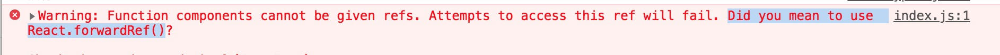

---
tags:
  - react
date: 2019-05-10
title: 项目中reacthook的迭代
vssue-title: 项目中reacthook的迭代
---

项目中reacthook的迭代

<!-- more -->

Hooks是React v16.7.0-alpha中加入的新特性。

本文主要是使用教程，记录下本人在持续开发中的react项目中对之前的页面的迭代笔记和一些总结。如果不了解，可以先看下我看到末尾的相关链接，我也是看这些教程的。

<br />

<!-- hooks是function component形式，而原先都是用class component。这两种编写方式是不同的。 -->

react生命周期有componentDidMount,componentDidUpdate等生命周期，那么想用hooks来替换原先的class component，那么必然要找到替代这写生命周期的方法。
<br />
下面就是介绍个人觉得hooks最最最常用到的一个api
<br />
useEffect，该 Hook 接收一个包含命令式、且可能有副作用代码的函数。
<br />
在函数组件主体内（这里指在 React 渲染阶段）改变 DOM、添加订阅、设置定时器、记录日志以及执行其他包含副作用的操作都是不被允许的，因为这可能会产生莫名其妙的 bug 并破坏 UI 的一致性。
<br />
执行时间
<br />
默认情况下，effect 将在每轮渲染结束后执行，但你可以选择让它 在只有某些值改变的时候 才执行。
<br />
那么，开始讲解下是如何代替那些生命周期
<br />

###### componentDidMount

组件在被挂载了之后会被调用
```
// useEffect 写法
React.useEffect(() => {
    // do somthing
}, []);
```

###### componentDidUpdate

更新阶段，当组件的props改变了，或组件内部调用了setState或者forceUpdate发生，会发生多次
```
// useEffect 写法
React.useEffect(() => {
   // do somthing
}, [props, state]);
```
在第二个参数（arr）,所指向的值的内存地址更换了，他就会执行。注意我说的是，内存地址。这里我有遇到自己写的一个坑，导致当时卡了很久。
```
React.useEffect(() => {
    // do somthing
}, [props.goodsListPage.current]);
// 换页
function handleTableChange({ current: pages }) {
  dispatch({
    type: 'goods/changGoodsPage',
    payload: {
      page: pages
    },
  });
}

changGoodsPage(state, { payload }) {
  const { page } = payload;
  const { goodsListPage } = state;
  goodsListPage.current = page;
  return {
    ...state,
    goodsListPage
  }
},
```
可以看出我实际是改变这个值，但是useEffect并没有执行,然后我更改了changGoodsPage函数的写法，将goodsListPage的值重新赋值，更改其的内存地址，这样就可以执行了。
<br />

###### componentWillUnmount

卸载阶段，当我们的组件被卸载或者销毁了

```
// useEffect 写法
React.useEffect(() => {
  return () => {
    // do somthing
  }
}, []);
```

因为实际项目中，我在写的时候，基本上没写过不传第二个参数的useEffect，所以就不介绍了。想学习就可以通过最下面的相关链接学习。
<br />
```
备注： 这里为什么被介绍useLayoutEffect（useEffect的同步api）？
因为我一是在项目中基本不用，二是因为文档中并不推荐一开始就使用这个。只有当useEffect出问题的时候再去尝试使用seLayoutEffect。
```
<br />

下面就开始介绍useState
<br />
基本使用方法
```
const [count, setCount] = useState(0);
```
第一个参数是变量名，第二参数是函数方法去改变这个变量，useState里放的是这参数的默认值
<br />
这里有个小tip，也是我当时写的时候，犯的错误。
<br />
```
const [count, setCount] = useState(0);
const [obj] = useState({ count });
```
当你使用setCount函数改变count的值时，变量obj是不是更改，因为在useState在定义变量时，是用深拷贝的。所以你直接定义const obj = { count }就可以了，不需要使用useState来定义。
<br />
最后讲一下，我用hooks写组件，当这个组件被引入到ant Design的from组件时，遇到的一个警告，虽然只是一个警告，并不影响程序运行，但是还是很想解决下。
<br />

<br />
这个警告大致意思是因为hooks是function component没有refs，需要用forwardRef()创建组件的refs。
```
export default React.forwardRef((props, ref) => {
  return <UploadImg {...props} forwardedRef={ref} />;
});
```
直接贴代码吧，有想详细了解的朋友可以看相关链接。
<br />


总结
---------------------
在项目将class component改成hooks版的function component，在内部打印执行的次数，可以看出渲染次数明显减少，而且代码量也大大减少。
这只是仅仅讲解了两个hooks的api，和我在实践犯的错误。后续若新的hooks的新的心得体会，在后续写上。


相关链接
---------------------
1。[译React高级话题之Forwarding Refs](https://juejin.im/post/5c0dd44b51882530e4617e92)
2。[react文档hooks](https://zh-hans.reactjs.org/docs/hooks-reference.html#useeffect)
3。[React Hooks 实用指南](https://github.com/monsterooo/blog/issues/28)
4。[useEffect 完整指南](https://overreacted.io/zh-hans/a-complete-guide-to-useeffect/)
4。[使用React Hooks复用复杂业务组件](https://segmentfault.com/a/1190000017576343)

