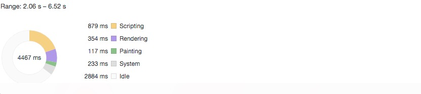

---
tags:
  - react
date: 2019-07-17
title: hooks优化你的函数式组件
vssue-title: hooks优化你的函数式组件
---

hooks优化你的函数式组件

<!-- more -->

因为hooks已经被运用到项目中，在多次使用和查阅react文档之后，对其的了解更多深入了一些。故也学会了一些优化小技巧。
<br />
先讲一下优化点，其实优化点也是部分是从class component类比过来。
<br />
比如class component是分普通的component还有一种purecomponent。
#### Component和PureComponent区别
简单的介绍下两者的区别。purecomponent提供了一个具有浅比较的shouldComponentUpdate方法。当props和state的值更改后，purecomponent会自动进行浅比较，若return true，则重新渲染这个jsx。反之，不渲染。
<br />
那么hooks是怎么实现PureComponent的呢？
<br />
在查阅文档后，[发现memo可以执行PureComponent的效果](https://zh-hans.reactjs.org/docs/react-api.html#reactmemo)。
```
  const MyComponentMemo = React.memo(function MyComponent(props) {
    /* 使用 props 渲染 */
  });
```
这种方法只能适用适用于函数式组件。memo接受的参数不止于一个参数，第一个参数是函数式组件，第二个参数可以是自定义的比较函数，若不传就用他自己的。这里文档中也提示这只是性能优化的方法，不用自定义的的比较函数来阻止函数的渲染，这样容易的产生bug。
<br />
class component每次props或者state的更改是重新执行一边render内的函数，那么function component每次props或者useReducer或者useState的更改，因为这个是函数式组件，所以他在更改的时候，函数作用域内的一切都是重新执行。
<br />
#### 减少重新定义
重新执行一遍，你这一听就感觉很消耗性能。那么hooks针对这个有什么性能优化呢？
<br />
```
function Hooks() {
  const [count, setCount] = useState(1);
  const [name, setName] = useState(1);
  const handleClick = () => {
    setCount(count++);
  }
  const handleNameClick = () => {
    setName(`${name}we`);
  }
  return (
    <div>
      <div onClick={handleClick}>{count}</div>
      <div onClick={handleNameClick}>{name}</div>
    </div>
  )
}
```
上述的函数式组件，在count或者name更改的时候，handleClick和handleNameClick函数都会被重新定义一遍，很消耗性能。
<br />
那么，你可以把这些函数放到函数式组件外面去，但是这个函数就没有这个函数式组件的作用域了。所以并不是很好的方法。
<br />
那么hooks了提供了[useCallback](https://zh-hans.reactjs.org/docs/hooks-reference.html#usecallback)。正是为了避免这种性能消耗过多的情况。
<br />
useCallback方法可以传两个参数，第一是参数是函数，第二个参数就是这个函数所依赖的数据，当这里的数据变化了，才会去重新定义新的函数。
<br />
下面就上一下我项目中函数式组件的函数定义的优化的效果。实验过程：在页面渲染完成进行普通tab切换实验，看tab切换的渲染效果如何
<br />
使用useCallback之前的
<br>

<br>
使用useCallback之后的
<br>

<br>
可以看出scripting的时间已经减少了。so，优化效果还是有的。


