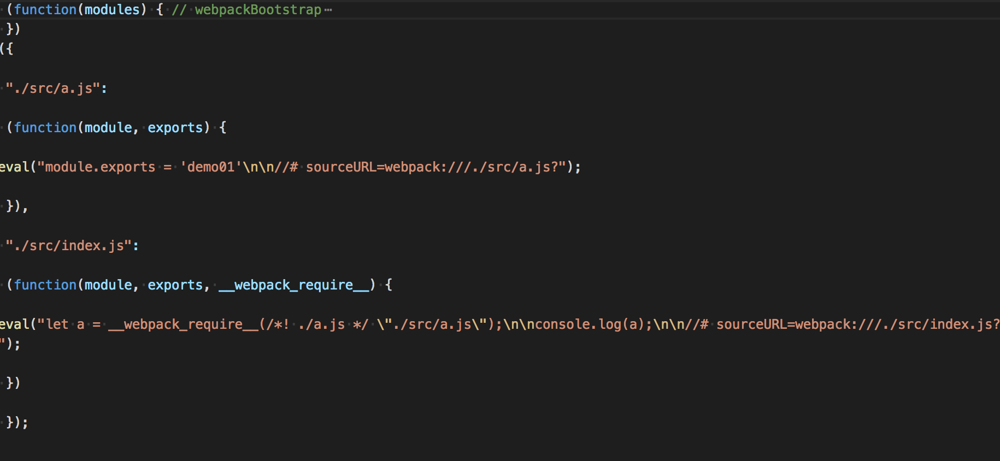
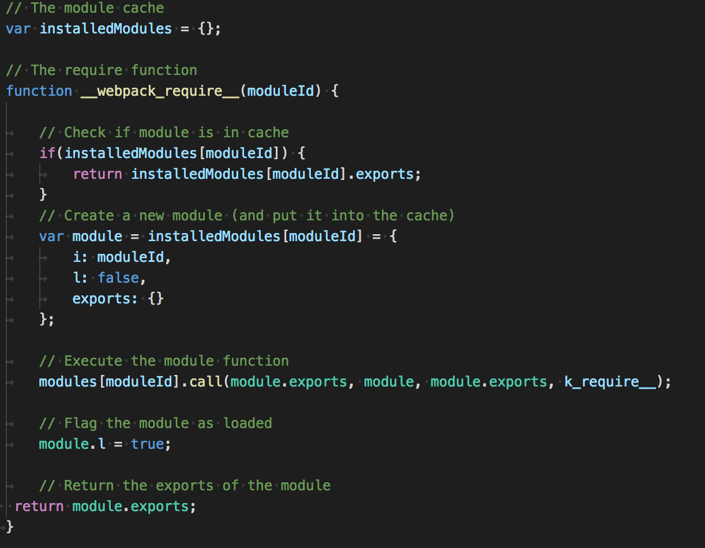
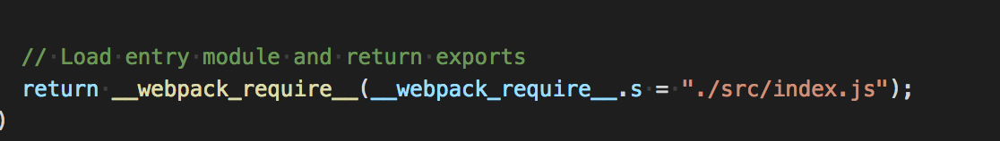
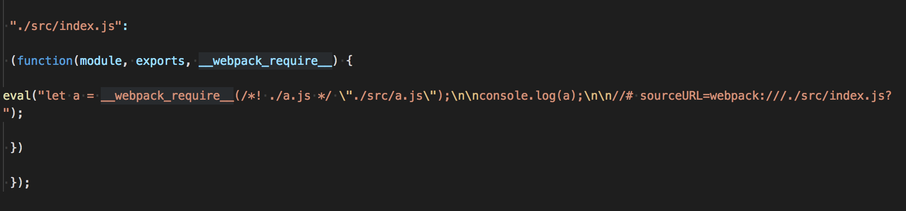

---
tags:
  - webpack
date: 2019-03-03
title: webpack(2)分析bundle
vssue-title: webpack(2)分析bundle
---

一起来看看webpack打包后的文件

<!-- more -->

bundle是由webpack打包出来的文件(文件束)，那么通过分析bundle文件，我们可以看看代码的模块机制。

1. 运行环境
```
webpack 4.29.3（只有4.X就可以了）
```

2. webpack的配置
```
let path = require('path')
module.exports = {
    mode: 'development', // webpack mode production 会默认开启开启压缩代码，要分析的话，就不能用这个模式
    entry: './src/index.js',
    output: {
        filename: 'bundle.js',
        path: path.resolve(__dirname, 'dists'),
    }
}
```
3. 要被打包的文件
新建src文件夹，在这个文件夹下新建一个a.js和index.js
a.js
```
module.exports = 'demo01'
```
index.js
```
let a = require('./a.js');

console.log(a);
```

4. 分析bundle


看出这个是一个匿名函数， 参数是一个对象，也可以看出这个对象就是我们想要打包的文件，key是路径，value是这个文件的函数
<br /> 
那么这个函数内有执行来什么操作呢？
<br /> 

 这个函数有变量（installedModules）来缓存module，这个对象存储的module也是个对象，有i（moduleId）l（是否被加载）exports（代码）。
这样webpack就能将匿名函数的所有参数（module）都放到了installedModules变量中，且输出module代码运行
<br />

这是这个匿名的return，它调用了内部的__webpack_require__函数，而__webpack_require__就是输出module代码，所以这就是定义了入口文件
<br />
定义了入口文件，那么来看看这个入口文件写了什么代码

可以看出其实它执行了__webpack_require__函数，来再加载别的module。
<br />
这就是基本一套webpack的打包运行机制。

